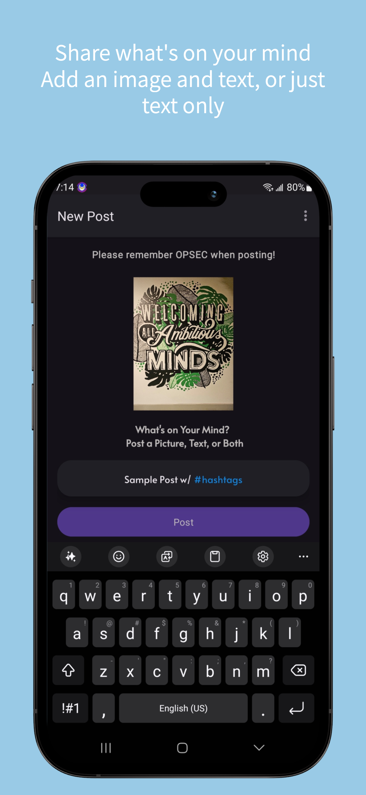
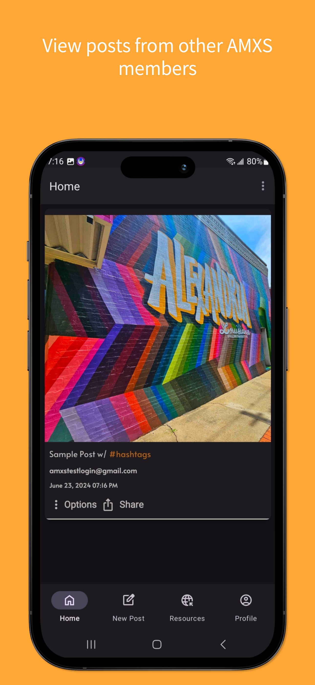
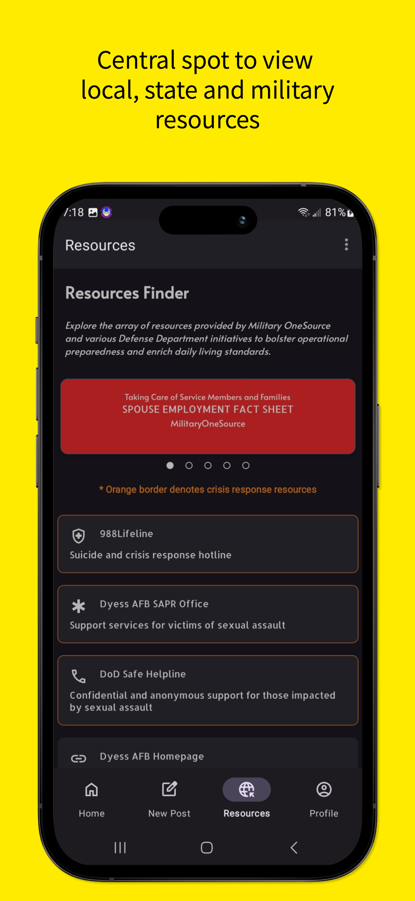
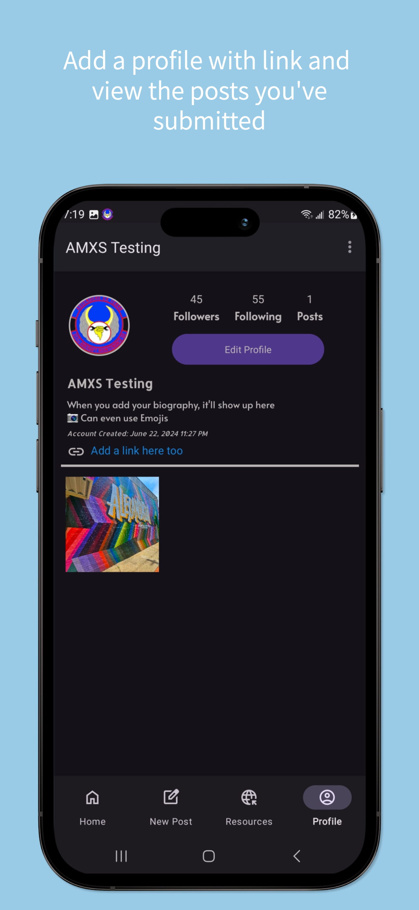

<!-- PROJECT LOGO -->
<br />
<div align="center">
  <a href="https://www.dyess.af.mil/units/317th-airlift-wing/317th-aircraft-maintenance-squadron/">
    
  </a>

  <h3 align="center">The Family Zone</h3>
  <h4 align="center">The iOS Companion App</h4>
  <h3 align="center"> Your Go-To Resource Hub for the 317th Aircraft Maintenance Squadron</h3>
  <p align="center">Welcome to The Family Zone, a dedicated platform designed specifically for the spouses and families of the 317th Aircraft Maintenance Squadron at Dyess AFB, Texas. Our mission is to foster a supportive community by providing essential resources, facilitating information sharing, and offering a space to connect and share moments.</p>
</div
<br />


## Key Features:
* Comprehensive Resources: Access a wide range of information tailored to the needs of military families, from local services and support groups to educational materials and wellness tips.
* Photo Sharing: Capture and share special moments with the squadron community. Our secure photo sharing feature allows you to keep memories alive and stay connected.
* Information Sharing: Stay updated with the latest news, events, and announcements. Whether it's squadron updates or local happenings, you'll always be in the know


### Project Setup
1. Clone the repo
```console
foo@bar:~$ git clone https://github.com/drewstephensdesigns/AMXSFamilyZone-iOS.git
```
To launch the mobile app, you will need:
1. Create a Firebase account (App).
2. Add the GoogleService-Info.plist file with your app data to the project (generated by Firebase).
3. Enable Authentication in Firebase (Sign-in providers): Email/Password.
4. Check and adjust the access rights of the Firestore Database (Cloud Firestore).

```
rules_version = '2';
service cloud.firestore {
  match /databases/{database}/documents {
    match /{document=**} {
      allow read, write: if request.auth != null;
    }
  }
}
```

<!-- SCREENSHOTS -->
<h3 align="center">Screenshots</h3>
<div align="center"; style="width:100%; display:flex; justify-content:space-between;">
  
  
  
  
</div>

## Tech Stack
The following libraries, frameworks, etc were used in the production of the apps

### iOS 🛠
- [Swift](https://www.apple.com/lae/swift/) - Robust and intuitive programming language created by Apple for building apps for iOS, Mac, Apple TV, and Apple Watch
- [SwiftUI](https://developer.apple.com/xcode/swiftui/) - SwiftUI helps you build great-looking apps across all Apple platforms with the power of Swift
- [UIKit](https://developer.apple.com/documentation/uikit) - UIKit provides a variety of features for building apps, including components you can use to construct the core infrastructure of your iOS, iPadOS, or tvOS apps
- [Firebase](https://firebase.google.com) - Cloud based Database and storage capabilities, scaled globally.

<!-- Contribute -->
## Contributing
Contributions are what make the open source community such an amazing place to learn, inspire, and create. Any contributions you make are **greatly appreciated**.

If you have a suggestion that would make this better, please fork the repo and create a pull request. You can also simply open an issue with the tag "enhancement".
Don't forget to give the project a star! Thanks again! For features still in work, or features that are planned, See the guide at [ROADMAP](https://github.com/drewstephensdesigns/AMXSFamilyZone/blob/main/ROADMAP.md).  These are also a great starter contribution!

1. Fork the Project
2. Create your Feature Branch (`git checkout -b feature/AmazingFeature`)
3. Commit your Changes (`git commit -m 'Add some AmazingFeature'`)
4. Push to the Branch (`git push origin feature/AmazingFeature`)
5. Open a Pull Request

<!-- CONTACT -->
## Contact

* [Follow me on Instagram](https://instagram.com/drewstephensdesigns)
* [Connect with me on LinkedIn](https://www.linkedin.com/in/drewstephens/)
* [Feedback Form](https://drewstephensdesigns.github.io/AMXSFamilyZone/contact)

* Drop me a note drewstephensdesigns@gmail.com

<!-- ACKNOWLEDGMENTS -->
## Acknowledgments
Thank you to my leadership team, for believing in me and for continuously supporting my pursuit of innovation.
> **Optimism is the faith that leads to achievement. Nothing can be done without hope and confidence** <br>
> Helen Keller

This project uses the following libraries and plug-ins:
* [Firebase](https://firebase.google.com)
  - Database
  - Storage
  - User Authentication
* [Material Icons for Android](https://fonts.google.com)
* [SF Symbols for Apple](https://developer.apple.com/sf-symbols/)

### Special Thanks and Helpful Links Used
* [Setting Up Firebase Authentication with email and password](https://medium.com/@mutebibrian256/firebase-authentication-with-email-and-password-in-android-using-kotlin-5fbe61ee6252)
* [iOS font sizes](https://gist.github.com/zacwest/916d31da5d03405809c4)
* [XCode repo out of date warning](https://stackoverflow.com/questions/48220681/xcode-the-local-repository-is-out-of-date)
* [Markdown Guide](https://docs.github.com/en/get-started/writing-on-github/getting-started-with-writing-and-formatting-on-github/basic-writing-and-formatting-syntax)
* [Swift Package Dependencies stopped working](https://stackoverflow.com/questions/69281786/local-swift-packages-stopped-working-in-xcode-13)
* [Preparing you app for review - Google Play](https://support.google.com/googleplay/android-developer/answer/9859455?#app_access)
